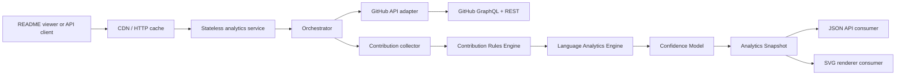

# RFC: Person-Centric GitHub Developer Analytics Platform

**Status:** Proposed  
**Revision:** Analytics-first MVP  
**Audience:** maintainers, contributors, deployers

## 1. Project vision

Build an open-source analytics engine that estimates and explains a developer’s personal contributions across GitHub.

The core product is a reliable, reusable analytics result—not an SVG card, dashboard, or repository popularity summary. Presentation surfaces consume that result:

- SVG profile cards;
- JSON API responses;
- future dashboards;
- scheduled reports;
- third-party integrations.

The system measures authored and collaborative activity across repositories, especially repositories the developer does not own.

**Why:** GitHub’s contribution model is person-based and spans repositories, but its native profile view is not a reusable, explainable analytics platform. [GitHub contribution documentation](https://docs.github.com/en/account-and-profile/concepts/contributions-on-your-profile)

## 2. Problem statement

Repository-centric statistics do not answer: “What work did this person contribute?”

A developer may make meaningful contributions through commits, pull requests, reviews, issues, and discussions in projects owned by organizations or other individuals. Raw GitHub counts are also noisy: generated files, vendored dependencies, lock-file churn, bulk formatting, and renames can distort estimates of authored code and language usage.

The product must therefore produce:

1. Person-scoped contribution data.
2. Rules-based estimates of meaningful authored changes.
3. Personal language estimates derived from contributed code, not repository ownership.
4. A clear confidence assessment describing data completeness and uncertainty.
5. Presentation-ready output that does not hide source limitations.

The product must not claim to objectively measure productivity, code quality, seniority, impact, or hiring suitability.

## 3. Existing solutions and limitations

| Category | Typical focus | Limitation |
|---|---|---|
| README statistic cards | profile aggregates, stars, owned repositories, language percentages | Presentation-first; insufficient person-centric contribution semantics. |
| GitHub native contribution graph | total qualifying activity | Useful baseline, but not a reusable analytics engine with filtering, confidence, or personal language attribution. GitHub’s own eligibility rules are nuanced and visibility-dependent. [GitHub contribution rules](https://docs.github.com/en/account-and-profile/reference/profile-contributions-reference) |
| Repository metrics | traffic, community health, repository activity | Repository-scoped by design, not developer-scoped. [GitHub REST metrics](https://docs.github.com/en/rest/metrics) |
| GitHub Readme Stats-style services | embeddable dynamic cards | Cards are the product boundary; private statistics and dependable operation commonly require self-hosting or generated snapshots. [github-readme-stats documentation](https://github.com/anuraghazra/github-readme-stats) |

## 4. Architectural principles

1. **Analytics first:** the analytics engine owns definitions, provenance, confidence, and computation.
2. **Presentation is downstream:** SVG, JSON, and future UI consume a stable analytics contract.
3. **Explain estimates:** every derived value identifies its source, ruleset, time window, and confidence.
4. **Prefer conservative output:** incomplete data must be marked partial, never represented as zero.
5. **Privacy by construction:** public results contain public data only.
6. **Small MVP, durable interfaces:** Version 1 avoids persistent infrastructure while preserving contracts needed for later scale.

## 5. Scope and roadmap

### MVP / Version 1

A stateless, self-hostable analytics service.

- Public GitHub login analytics.
- Versioned JSON analytics endpoint.
- SVG renderer consuming the JSON/domain analytics view-model.
- Contribution totals and timeline by type:
  - commits;
  - pull requests opened;
  - pull requests merged;
  - reviews;
  - issues;
  - discussions where accessible.
- Repository relationship classification:
  - self-owned;
  - organization-owned;
  - external;
  - unknown.
- Contribution Rules Engine for code-change filtering.
- Language Analytics Engine for estimated personal language usage.
- Confidence model and partial-result reporting.
- In-process bounded caching only; CDN HTTP caching encouraged.
- No database, Redis, background workers, dashboard, sign-in, or private analytics.

**Why:** This proves the difficult product thesis—credible personal analytics—before adding accounts, persistence, jobs, and a web application.

### Version 2

Persistent, authenticated personal analytics.

- GitHub App sign-in and authorized/private data.
- PostgreSQL for account preferences, snapshots, provenance, and retention controls.
- Redis for shared cache, distributed refresh locks, queues, and rate-limit coordination.
- Background refresh workers and scheduled snapshots.
- Personal dashboard.
- User-managed ruleset preferences and private shareable snapshots.
- Webhook-driven cache invalidation where applicable.

**Why:** Private data and recurring refreshes require durable state and careful authorization; they should follow a validated public analytics engine.

### Version 3

Collaboration and extensibility.

- Organization and team analytics with consent and aggregate visibility controls.
- GitHub Enterprise Cloud and GitHub Enterprise Server support.
- Provider-neutral adapter interface for future forges.
- Plugin API for metric packs, presentation layouts, and rulesets.
- Historical trends, exports, scheduled reports, and signed immutable snapshots.
- Opt-in comparisons or benchmarks, never default rankings.

**Why:** These features introduce governance, compliance, and multi-tenant complexity that should not shape the MVP.

## 6. Functional requirements

### 6.1 Analytics contract

For a requested GitHub login and time window, produce an `AnalyticsSnapshot` conceptually containing:

- subject identity;
- requested and effective time window;
- contribution totals by activity type;
- repository relationship breakdown;
- qualified authored-change estimates;
- personal language estimates;
- ruleset version and rules applied;
- confidence level and reasons;
- source coverage and inaccessible-source indicators;
- retrieval time and freshness;
- metric-definition version.

**Why:** This is the stable product boundary. Consumers should never need to reconstruct analytics from raw GitHub data.

### 6.2 SVG consumer

The SVG endpoint accepts a completed analytics result or resolves one internally, then renders a selected subset. It must not make independent metric decisions.

SVG cards can display:

- selected metrics;
- time window;
- confidence badge;
- “partial data” indicator;
- theme and locale;
- generated time/freshness.

**Why:** A card must be a faithful view of the analytics contract, not a parallel analytics implementation.

### 6.3 Explicit exclusions

Version 1 excludes:

- private repositories and authenticated access;
- user accounts and stored preferences;
- persistent snapshots;
- dashboards;
- repository traffic;
- star/fork popularity metrics;
- exact productivity or quality scores;
- exact line-of-code claims where the source cannot support them.

## 7. High-level architecture



### Component responsibilities

| Component | Responsibility |
|---|---|
| Orchestrator | Coordinates retrieval, bounded concurrency, time window, and result assembly. |
| GitHub API adapter | Executes named GraphQL/REST requests, pagination, retries, and surfaces API limitations. |
| Contribution collector | Converts GitHub responses into normalized authored activity and changed-file candidates. |
| Contribution Rules Engine | Determines whether a file/change should contribute to qualified authored-change metrics. |
| Language Analytics Engine | Estimates language composition from qualified authored changes. |
| Confidence Model | Classifies result completeness and explains degraded confidence. |
| Analytics Snapshot builder | Produces the versioned, presentation-neutral result. |
| JSON API consumer | Serializes the snapshot. |
| SVG renderer consumer | Maps the snapshot to an accessible, deterministic visual card. |

**Why:** The only component permitted to define metrics is the analytics path. JSON and SVG have no direct GitHub access and no metric logic.

## 8. Proposed repository structure

```text
/
├─ apps/
│  └─ api/                         Stateless HTTP service and SVG routes
├─ packages/
│  ├─ domain/                      Versioned analytics contracts and definitions
│  ├─ github-client/               GraphQL/REST adapter and query catalog
│  ├─ contribution-collector/      Normalized activity and changed-file collection
│  ├─ contribution-rules/          Rule evaluation, defaults, explanations
│  ├─ language-analytics/          Language attribution and estimation
│  ├─ confidence-model/            Completeness and confidence assessment
│  ├─ analytics-engine/            Orchestration and snapshot assembly
│  ├─ svg-renderer/                Presentation-only SVG layouts
│  ├─ themes/                      Validated shared theme tokens
│  ├─ api-contracts/               HTTP schemas and problem details
│  ├─ observability/               Logs, traces, metrics, diagnostics
│  └─ test-fixtures/               Recorded and synthetic GitHub fixtures
├─ docs/
│  ├─ rfc/
│  ├─ metric-definitions/
│  ├─ rules/
│  ├─ confidence/
│  ├─ api/
│  └─ operations/
├─ infra/
│  ├─ container/
│  └─ deployment/
└─ .github/
   └─ workflows/
```

**Why:** The repository reflects the product hierarchy: analytics modules are first-class; rendering is isolated as an adapter.

## 9. GitHub API strategy

### Primary source: GraphQL

Use GitHub GraphQL for developer identity, contribution summaries, calendars, activity relationships, and batched repository context.

### Targeted REST complement

Use REST only when it is better suited for commit/file-level details or an unavailable GraphQL capability.

**Why:** GraphQL efficiently expresses person-to-contribution relationships, while some granular commit/file details may require REST. The adapter insulates the core analytics engine from either transport.

### Query discipline

- Named, reviewed queries only.
- Explicit pagination and bounded query depth.
- Small, incremental batches.
- Field selection limited to active metrics.
- API response metadata retained for confidence assessment.
- No arbitrary user-supplied GraphQL.

GitHub requires pagination arguments on GraphQL connections, limits individual requests to 500,000 nodes, and can time out expensive queries. [GitHub GraphQL limits](https://docs.github.com/en/graphql/overview/rate-limits-and-query-limits-for-the-graphql-api)

## 10. Contribution Rules Engine

The Contribution Rules Engine converts raw changed-file information into a **qualified authored-change estimate**.

It does not determine whether a developer “worked hard” or whether a change was valuable.

### Inputs

- commit/PR metadata;
- file paths and statuses;
- additions/deletions where available;
- language classification;
- repository metadata;
- diff metadata or patch text where available;
- configured ruleset version.

### Default rules

| Rule | Default behavior | Why |
|---|---|---|
| Generated files | Exclude known generated paths/extensions and files marked generated where detectable. | Generated artifacts inflate source totals without reflecting authored source work. |
| Lock files | Exclude standard dependency lock files. | Their large diffs typically describe dependency resolution rather than personal language usage. |
| Vendored code | Exclude conventional `vendor`, third-party, generated dependency paths and detected vendored content. | Imported code must not be attributed to the contributor. |
| Formatting-only commits | Exclude from qualified code-change totals when diff heuristics identify only whitespace/formatting changes. Preserve the activity record. | Formatting is valid work but should not dominate code-volume or language estimates. |
| Renamed files | Treat pure rename/move operations as zero qualified code change; retain the event. For rename-plus-edit, count only changed content when available. | A rename is not newly authored code. |
| Binary/minified files | Exclude from language volume; record a rule reason. | Source attribution is unreliable. |
| Documentation | Include as a distinct language/content category by default, but report separately from executable code. | Documentation is meaningful contribution and should not disappear. |

### Rule result

Each file/change receives:

- `included`, `excluded`, or `indeterminate`;
- rule identifiers and human-readable reasons;
- estimated qualified additions/deletions where supported;
- confidence impact.

### Limitations

GitHub API responses do not guarantee enough diff detail to perfectly distinguish formatting-only edits, generated content, or rename-plus-edit changes in every case. Therefore, the rules engine uses transparent heuristics and may classify changes as indeterminate rather than forcing a decision.

**Why:** Honest uncertainty is better than a precise-looking but unsupported “lines written” number.

## 11. Language Analytics Engine

The Language Analytics Engine estimates personal language usage from **qualified authored changes**, not from the languages present in repositories a developer owns or touched.

### Method

1. Take contribution-associated file changes that pass the Contribution Rules Engine.
2. Map each file to a language using a pinned, versioned classifier.
3. Attribute qualified additions/deletions to languages when available.
4. Maintain separate categories for:
   - executable/source languages;
   - markup and documentation;
   - configuration;
   - unknown/binary/indeterminate.
5. Aggregate by selected time window.
6. Emit percentages only alongside totals, exclusions, and confidence.

### Output example

- `TypeScript: estimated 42% of qualified changed lines`
- `Markdown: estimated 18% of qualified changed lines`
- `Unknown/indeterminate: 11%`
- `Excluded generated/lock/vendor changes: 29%`

This is an estimate of the developer’s contributed code composition during a period. It is not a statement of expertise, proficiency, or all-time usage.

**Why:** Repository-level language percentages attribute whole codebases to a person. Changed-file attribution is more aligned with the product’s person-centric premise.

## 12. Confidence model

Every analytics snapshot includes a confidence assessment.

### Confidence levels

| Level | Meaning |
|---|---|
| `high` | Requested window was covered with sufficient source data; no material known gaps. |
| `moderate` | Core activity is available, but some estimations or limited source coverage reduce precision. |
| `partial` | Known inaccessible repositories, API omissions, pagination limits, or missing file-level evidence materially affect results. |
| `unavailable` | A trustworthy result cannot be produced. |

### Confidence dimensions

- **Activity coverage:** whether contribution events were retrieved for the requested period.
- **Repository accessibility:** whether relevant repositories/files were inaccessible or deleted.
- **Change-detail coverage:** whether changed-file and diff information supports qualified-change estimates.
- **Language attribution coverage:** share classified versus unknown/excluded changes.
- **Rule certainty:** proportion of included/excluded/indeterminate change volume.
- **API health:** rate limiting, timeouts, partial GraphQL errors, or schema limitations.
- **Time-window completeness:** whether the full requested range could be evaluated.

### Required result behavior

- A partial result includes machine-readable reason codes and human-readable explanations.
- Unavailable categories are omitted or marked unavailable, never rendered as zero.
- SVG cards must display a compact partial-data indicator when confidence is below `high`.
- JSON provides the full explanation and coverage ratios.

**Why:** Public GitHub data is visibility- and API-dependent. Confidence is essential to prevent consumers from mistaking incomplete observation for absence of contribution.

## 13. Authentication and privacy

### Version 1

- Public GitHub data only.
- No user authentication.
- No personal access token input.
- No stored user records.
- A service-owned credential may be used solely to improve public API capacity, with strict request controls.

### Version 2

Adopt a GitHub App using the OAuth web flow and minimum read permissions for authorized/private analytics.

GitHub recommends GitHub Apps over traditional OAuth Apps because they offer fine-grained permissions, greater repository control, and short-lived tokens. [GitHub guidance](https://docs.github.com/en/apps/oauth-apps/building-oauth-apps)

**Why:** Deferring authentication makes Version 1 safer and operationally simpler, while the GitHub App path preserves a secure expansion route.

## 14. SVG rendering engine

The SVG renderer is a pure consumer of `AnalyticsSnapshot`.

It:

- selects existing metrics;
- applies registered theme tokens;
- renders deterministic, accessible SVG;
- includes title, description, metric window, and confidence indicator;
- has no GitHub client, rules, language attribution, or calculation code.

It must not:

- recompute totals;
- hide partial confidence;
- inspect raw API responses;
- make private data available in public endpoints.

**Why:** This prevents the common failure mode of metrics diverging between an API and its visual card.

## 15. Theme system

Themes are small declarative token sets:

- background and surface;
- primary/muted text;
- accent and semantic status colors;
- chart palette;
- spacing and typography scale.

Version 1 supports curated themes only. Each theme is contrast-validated and versioned.

**Why:** Curated tokens maintain visual quality, accessibility, deterministic output, and effective CDN caching.

## 16. Cache and rate limiting

### Version 1 cache

- HTTP cache headers designed for CDN use.
- Small, bounded in-process cache for repeated requests within one instance.
- No shared cache, queue, database, or refresh worker.
- Cache keys include login, time window, metric version, ruleset version, theme, and renderer version.
- Public responses may use stale-on-error behavior only when freshness is explicitly disclosed.

**Why:** CDN caching provides most of the value for embeddable cards without adding Redis operational complexity.

### Rate-limit policy

- Per-client request limits at the HTTP edge.
- Per-login refresh limits to prevent cache-bypass abuse.
- Bounded outbound concurrency.
- Query cost awareness and early termination when budget is too low.
- Exponential backoff with jitter for transient GitHub failures.
- Respect GitHub reset and retry headers.
- Return a clear deferred/rate-limited response rather than retrying aggressively.

GitHub GraphQL limits are token- and query-cost-based, with additional secondary limits for concurrency and request rates. [GitHub rate-limit documentation](https://docs.github.com/en/graphql/overview/rate-limits-and-query-limits-for-the-graphql-api)

## 17. Error handling

Use a stable problem-details contract containing:

- error code;
- safe user-facing message;
- correlation identifier;
- retryability;
- confidence impact;
- recommended retry time where applicable.

Key errors:

- invalid input;
- user not found;
- inaccessible or deleted source;
- upstream rate limit;
- upstream timeout;
- partial GitHub response;
- insufficient evidence for language analysis;
- internal failure.

A failed or partial fetch must never appear as “0 contributions.”

## 18. Non-functional requirements

| Area | Version 1 target | Why |
|---|---|---|
| Correctness | Versioned definitions, rules, and confidence reasons. | Results must be reviewable. |
| Performance | Cached p95 under 250 ms; uncached common-profile p95 under 5 seconds. | README embeds need predictable loading. |
| Availability | Graceful degraded results during GitHub failures. | Upstream dependency should not create misleading output. |
| Security | No user credentials or private data in MVP. | Reduces attack surface. |
| Accessibility | Accessible SVG text alternatives and contrast-compliant themes. | Cards must be readable beyond visual presentation. |
| Observability | Request ids, structured logs, upstream timing, query cost, confidence distribution. | Analytics failures require diagnosis. |
| Self-hosting | Single stateless service plus optional CDN. | Keeps adoption friction low. |

## 19. Testing strategy

| Test layer | Focus |
|---|---|
| Unit | Metric aggregation, time boundaries, rule decisions, confidence classification, language attribution. |
| Fixture | GitHub responses for renamed files, generated paths, lock files, vendored code, deleted repositories, inaccessible content, pagination, and partial responses. |
| Property-based | Deduplication, aggregation invariants, rename handling, and non-negative qualified-change estimates. |
| Contract | Versioned JSON response and SVG view-model compatibility. |
| Visual regression | SVG layout, themes, confidence badges, and partial-data states. |
| API integration | Query pagination, rate-limit headers, transient errors, and incomplete data behavior. |
| Security | Input escaping, SVG injection prevention, cache-key isolation, request limits. |
| Performance | Cold and warm profile requests, high-cardinality query parameters, and rate-limit exhaustion. |

**Why:** The highest-risk failures are semantic: incorrectly attributing generated or inaccessible code to a developer.

## 20. Decisions for approval

1. The analytics engine is the core product and source of truth.
2. The SVG renderer is strictly a downstream analytics consumer.
3. Version 1 is stateless and excludes PostgreSQL, Redis, workers, dashboards, and authentication.
4. Qualified code-change estimates require a transparent Contribution Rules Engine.
5. Personal language usage is calculated from qualified authored changes, not repository language totals.
6. Every result exposes a confidence level and explanation.
7. Incomplete data is reported as partial or unavailable, never as zero.
8. The roadmap introduces persistence and private analytics only in Version 2.
9. The product will not produce developer ranking, quality, or productivity scores.